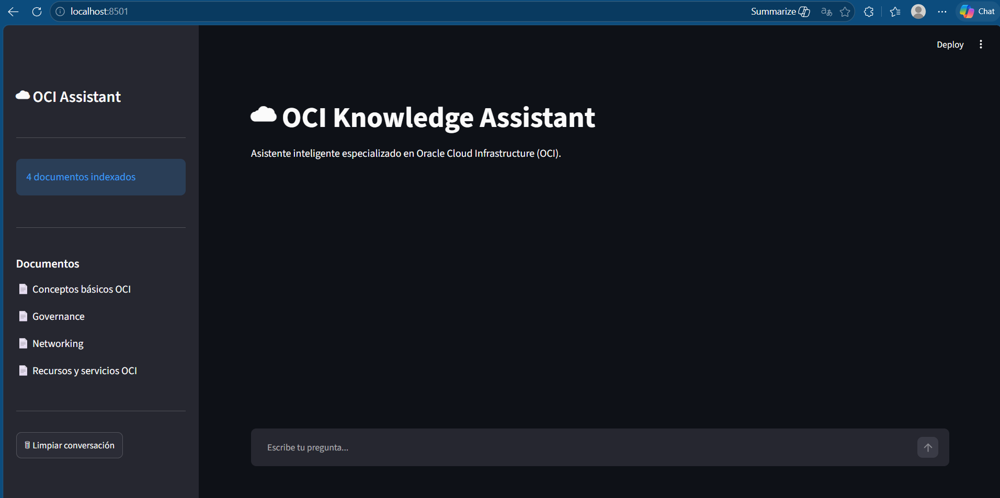
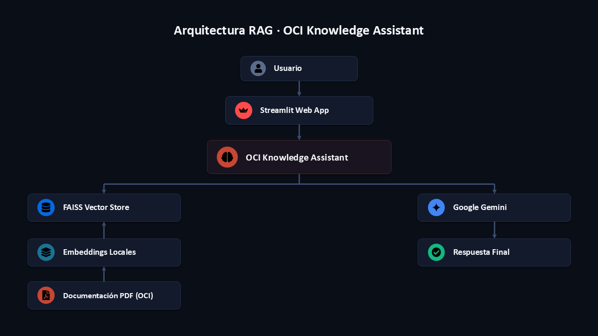
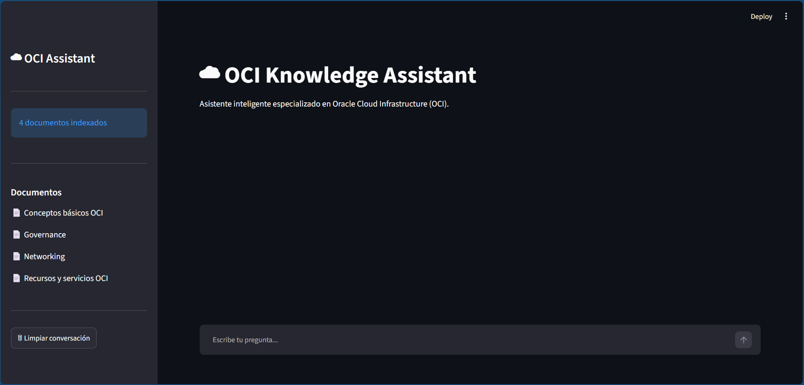
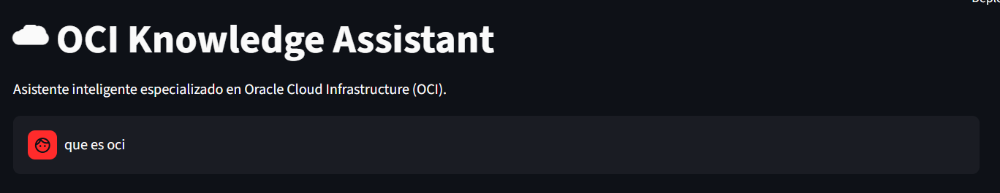
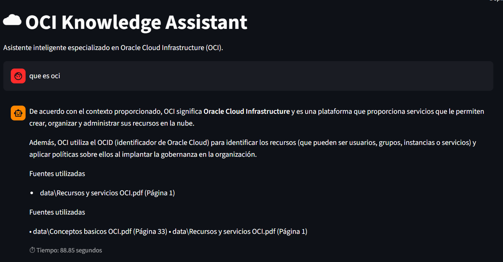

# ☁ OCI Knowledge Assistant



Asistente inteligente basado en IA...


# OCI Knowledge Assistant

Asistente inteligente desarrollado con Inteligencia Artificial para consultar documentación de **Oracle Cloud Infrastructure (OCI) mediante lenguaje natural.

El proyecto implementa una arquitectura RAG (Retrieval-Augmented Generation) utilizando documentos PDF como base de conocimiento, embeddings locales con Sentence Transformers, FAISS como base vectorial y Google Gemini como modelo generativo.


# Objetivo

Facilitar la búsqueda de información técnica sobre Oracle Cloud Infrastructure sin necesidad de revisar manualmente múltiples documentos PDF.

El usuario simplemente realiza una pregunta y el asistente responde utilizando únicamente la información almacenada en la base documental.


# Características

- Consulta documentación PDF mediante lenguaje natural.
- Arquitectura RAG.
- Base vectorial FAISS.
- Embeddings locales (Sentence Transformers).
- Integración con Google Gemini.
- Historial de conversación.
- Interfaz web desarrollada con Streamlit.
- Muestra las fuentes utilizadas para generar cada respuesta.


# Arquitectura




# Tecnologías utilizadas

| Tecnología | Descripción |
|------------|-------------|
| Python | Lenguaje principal |
| Streamlit | Interfaz Web |
| LangChain | Framework RAG |
| FAISS | Base vectorial |
| Sentence Transformers | Embeddings locales |
| Google Gemini | Modelo de lenguaje |
| Oracle Cloud Infrastructure | Plataforma de despliegue |


# Base de conocimiento

La documentación utilizada corresponde a Oracle Cloud Infrastructure.

Actualmente se indexan los siguientes documentos:

- Conceptos básicos OCI
- Governance
- Networking
- Recursos y servicios OCI


# Estructura del proyecto

oci-knowledge-assistant/

├── assets/
├── data/
├── db/
├── src/
├── test/

├── app.py
├── streamlit_app.py
├── requirements.txt
├── README.md
├── .env.example
```


# Instalación

Clonar el repositorio
bash
git clone https://github.com/TU-USUARIO/oci-knowledge-assistant.git


Entrar al proyecto

bash
cd oci-knowledge-assistant

Crear entorno virtual

bash
python -m venv venv


Activar entorno

Windows

powershell
.\venv\Scripts\activate


Linux

bash
source venv/bin/activate


Instalar dependencias

bash
pip install -r requirements.txt


Crear archivo

.env


Agregar

env
GEMINI_API_KEY=TU_API_KEY

Ejecutar

bash
streamlit run streamlit_app.py


---

# Ejemplos de preguntas

- ¿Qué es Oracle Cloud Infrastructure?
- ¿Qué servicios ofrece OCI?
- ¿Qué es un block storage?
R = De acuerdo con el contexto proporcionado, el almacenamiento de bloques (block storage) se define por las siguientes características:

Acceso y organización: Está organizado mediante un sistema de archivos y se accede a él a través de una red de almacenamiento dedicada, comúnmente conocida como SAN (red de área de almacenamiento).
Limitación física: Está limitado al tamaño físico del disco o de la matriz de discos.
Rendimiento y uso: Se considera la opción de mayor rendimiento para la mayoría de las aplicaciones, por lo que es ideal para bases de datos y aplicaciones esenciales.
Fuentes utilizadas

data\Conceptos basicos OCI.pdf (Página 17)
Fuentes utilizadas

• data\Conceptos basicos OCI.pdf (Página 17) • data\Conceptos basicos OCI.pdf (Página 35)

- ¿Qué es Object Storage?
R = Basándose en el contexto proporcionado, Object Storage es una arquitectura de almacenamiento de datos que gestiona los datos como objetos.

Sus principales características y usos son:

Presenta una capacidad masiva.
Permite almacenar datos no estructurados.
Se suele utilizar comúnmente para datos de análisis, almacenamiento de documentos y recuperación ante desastres.
Fuentes utilizadas

Documento: data\Conceptos basicos OCI.pdf (Página 17)
Fuentes utilizadas

• data\Conceptos basicos OCI.pdf (Página 17) • data\Conceptos basicos OCI.pdf (Página 30)

---

# Capturas

Pantalla principal



---

## Consulta



---

## Respuesta



---

# Despliegue

La aplicación será desplegada sobre Oracle Cloud Infrastructure (OCI) utilizando una instancia Compute Always Free.


# Posibles mejoras

- Carga dinámica de documentos PDF.
- Memoria conversacional avanzada.
- Búsqueda híbrida.
- Soporte para documentos Word y PowerPoint.
- Autenticación de usuarios.
- Panel administrativo.


# Autor

Jonathan López Hernández

Ingeniero en Sistemas Computacionales

Especializado en:

- Oracle Cloud Infrastructure
- Business Intelligence
- Oracle Analytics Cloud
- Python
- Inteligencia Artificial

Proyecto desarrollado para el Challenge Alura Agente.
